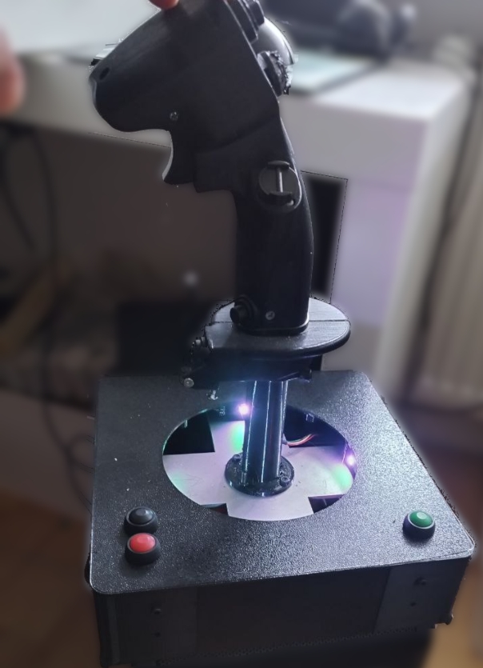
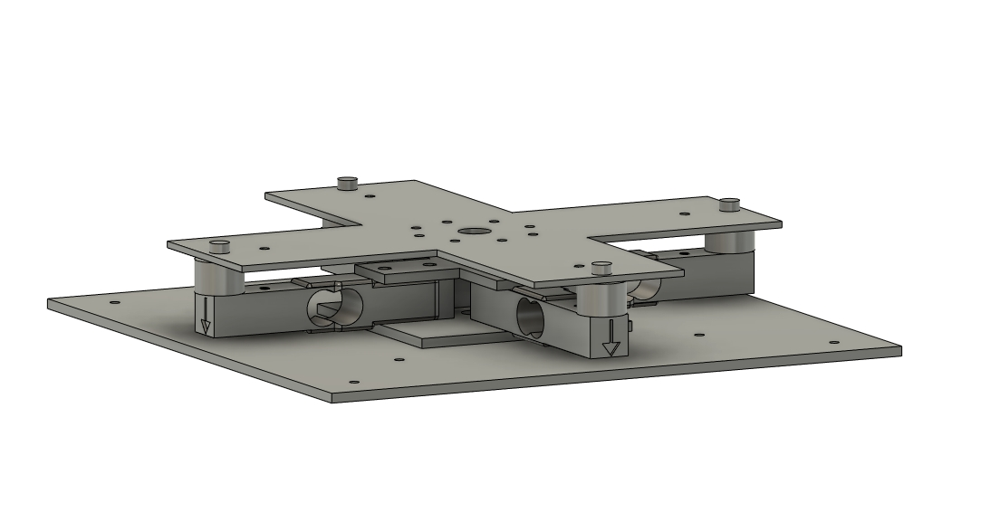
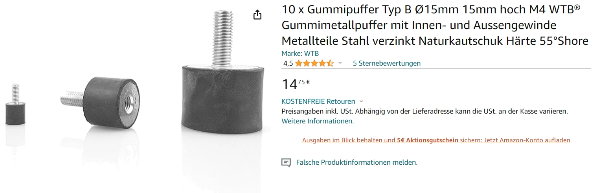
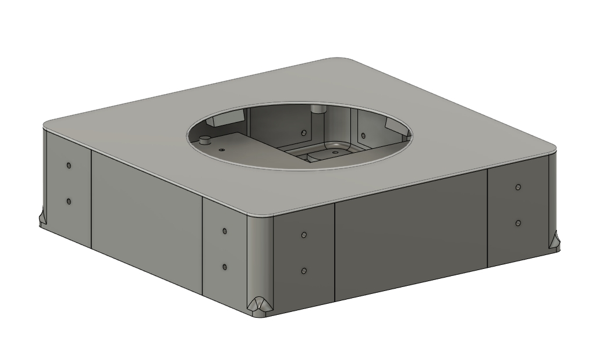
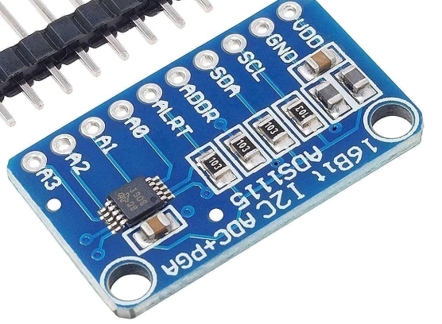
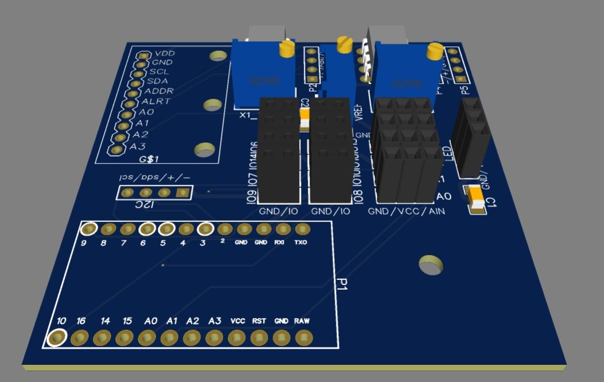
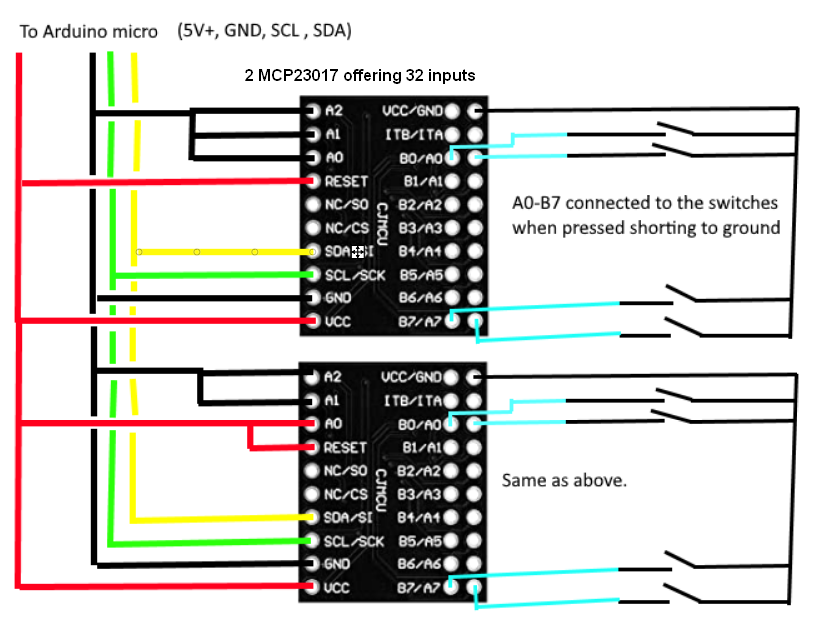

# My F16 Sidestick

This repository holds (almost) all the information about my DIY F16 Force Sensing Sidestick I use mainly in DCS

The stick itself is printed from **https://www.thingiverse.com/thing:4544115**

I used different switches (navigation switches which I had laying around together with fitting PCBs. If those wouldn't have already existed in my drawer I would have used the switch designs included in the Thingiverse project.

My initial version was based on the well known olukelo gimbal with hall effect sensors, so I used the adapter I had on the gimbal for my force sensing approach too.

## Components
beside the F16 Grip & Adapter
### Mechanic components
**Metal parts**

* **1x Ground plate** (BodenPlatte.dxf)
* **1x Ground distance plate** (BodenDist.dxf) - ensures distance between the load cells and the ground plate)
* **1x Top cross** (Topkreuz.dxf) -connects the upper sides of the load cells in the center)
* **1x Top plate** (Joyplate.dxf) 

I ordered the aluminum parts at Xometry made out of 3mm sheets of EN AW-6060 / 3.3206 / Al-MgSi
All 4 parts in the folder Hardware\Metal_parts together came with a total order value of  68.78 Euro

**Other**

* A unknown amount of M4 and M3 screws and nuts ;)
* **4 rubber buffers** (15mm diameter, 15mm lenght, M4 screw thread 

**Load cells**

* **4 x 80mm Load Cells** (mine are 3kg, but that's personal preference). Be aware that **there are 80mm and 75mm versions available, I designed it using the 80mm** I already had at home 

### Case

The case consists of 
* 4 **Side parts** (Seiten_thin.stl - all 4 attached together)
* 4 **Corners** (Ecken_thin.stl- all 4 attached together)
* 1 **Lid** (Deckel_nd.stl)

The lid has small ramps to which I attached 4 WS2812B LEDs I cut from a strip I had laying around.

### Electronics

* **Arduino Pro Micro (Clone)** If you need to buy one, be sure to buy one with 5V (there are 3.3V and 5V available) and USB-C socket (the damn micro USB sockets are only SMD attached to the circuit boad and rip off easily)

* **1x ADS1115 16bit ADC Modul** for example by AZ delivery. But there are dozen other manucaturers which use the same board layout (ADS1115.jpg)

* **2x MCP 23017 IO Expander moduls**  
* **2x INA 122P instrument amplifier** (I used sockets, but can be soldered directly to the PCB
* **1x Potentiometer >=10k type  3296 - 3/8 ? Square Trimpot** 
* **2x Potentiometer (same 3296 type, but 100 or 200 Ohm)**

* **1x Base PCB** That's the printed circuit board which holds all components in the base. 

(the PCB has some additional ports, for up to 4 analog and 8 digital inputs, I connected 3 additional digital inputs to buttons. One for recalibration of the center position and noise and 2 for ingame functions)

**Stick internal wiring**

Internally all the buttons in the stick are wired up to 2 MCP23017 boards (as shown in Wire-connection.png). That means I only have 4 wires going out of the joystick into my PCB

